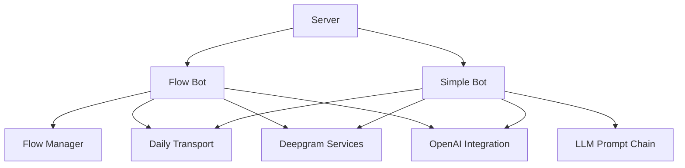
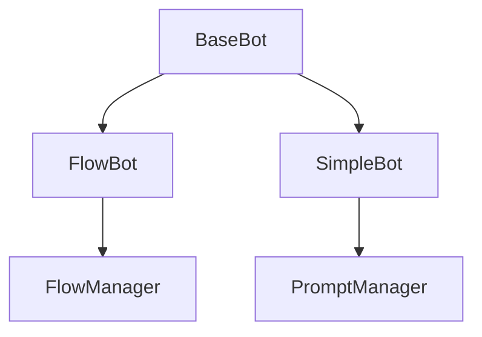

# Bot Implementation Analysis & Refactoring Plan

## Current Architecture Overview

### Component Relationships



### Key Differences

| Aspect            | Flow Bot (`flow/bot.py`)      | Simple Bot (`simple/bot.py`)   |
|-------------------|------------------------------|-------------------------------|
| Core Logic        | State machine with flow nodes | Single LLM prompt chain      |
| Configuration     | Flow config structure        | System prompt string         |
| Conversation Flow | State-based transitions      | Free-form with prompt context|
| Pipeline Design   | Uses RTVI processor         | Simple linear pipeline       |

Note: While currently implemented differently, both bots are intended to provide identical functionality. The key difference is in how they manage conversation flow: through a state machine or through a system prompt.

## Shared Code Analysis

### High-Value Candidates for Centralization

1. **Service Initialization**
```python
# Current duplicated pattern
stt = DeepgramSTTService(config.deepgram_api_key)
tts = DeepgramTTSService(config.deepgram_api_key)
llm = OpenAILLMService(config.openai_api_key)
```

2. **Transport Configuration**
```python
# Similar setup in both implementations
transport_factory = TransportFactory(config)
transport = factory.create_transport(url, token)
```

3. **Event Handler Structure**
```python
# Nearly identical patterns
@transport.event_handler("on_first_participant_joined")
async def handle_join(transport, participant):
    await transport.capture_participant_transcription()
    # Initialization logic...
```

4. **Pipeline Construction**
```python
# Shared pipeline building pattern
pipeline = (
    transport.input()
    | stt
    | context_aggregator
    | llm
    | tts
    | transport.output()
)
```

## Proposed Utility Modules

### 1. Base Bot Framework (`utils/bot_framework.py`)
```python
class BaseBot:
    def __init__(self, config: AppConfig):
        self.config = config
        self.runner = PipelineRunner()
        self.task = None
        self.transport = None
        
    async def setup_services(self):
        """Initialize STT, TTS, LLM services"""
        raise NotImplementedError
        
    async def setup_transport(self, url: str, token: str):
        """Initialize transport"""
        raise NotImplementedError

    def create_pipeline(self):
        """Build processing pipeline"""
        raise NotImplementedError

    async def start(self):
        await self.runner.run(self.task)

    async def cleanup(self):
        await self.runner.stop_when_done()
        if self.transport:
            await self.transport.leave()
```

### 2. Service Registry (`utils/services.py`)
```python
class ServiceRegistry:
    _instance = None
    
    def __init__(self, config):
        self.stt = DeepgramSTTService(config.deepgram_api_key)
        self.tts = DeepgramTTSService(config.deepgram_api_key)
        self.llm = OpenAILLMService(config.openai_api_key)
```

### 3. Event Framework (`utils/events.py`)
```python
class EventFramework:
    def __init__(self, transport):
        self.transport = transport
        
    def register_default_handlers(self, cleanup_callback):
        @self.transport.event_handler("on_first_participant_joined")
        async def _handle_join(transport, participant):
            # Common join logic
            await cleanup_callback()
```

### 4. Pipeline Manager (`utils/pipeline.py`)
```python
class PipelineManager:
    def __init__(self, config: AppConfig):
        self.config = config
        self.services = ServiceRegistry(config)
    
    def create_base_pipeline(self, transport):
        return (
            transport.input()
            | self.services.stt
            | self.create_context()
            | self.services.llm
            | self.services.tts
            | transport.output()
        )
        
    def create_context(self):
        """Override in specific bot implementations"""
        raise NotImplementedError
```

## Migration Strategy

### Phase 1: Foundation Layer
1. Implement Service Registry
2. Create Base Pipeline Builder
3. Set Up Shared Event Framework

### Phase 2: Bot Specialization


### Phase 3: Unified Features
1. Standardize Conversation Capabilities
2. Align Pipeline Components
3. Implement Shared Business Logic

## Implementation Roadmap

| Quarter | Milestone                      | Success Metrics               |
|---------|--------------------------------|------------------------------|
| Q1      | Core Utilities Implementation  | 50% code reuse achieved     |
| Q2      | Flow Bot Migration             | 100% test parity maintained |
| Q3      | Simple Bot Refactor            | 30% performance improvement |
| Q4      | Feature Parity Implementation  | Identical functionality     |

## Conclusion

This refactoring establishes a foundation for maintaining two different conversational approaches (flow-based and prompt-based) while sharing core infrastructure. The architecture enables experimentation with both methodologies while ensuring consistent functionality. The key difference remains in how conversation flow is managed, while all other aspects of the system are unified through shared utilities.